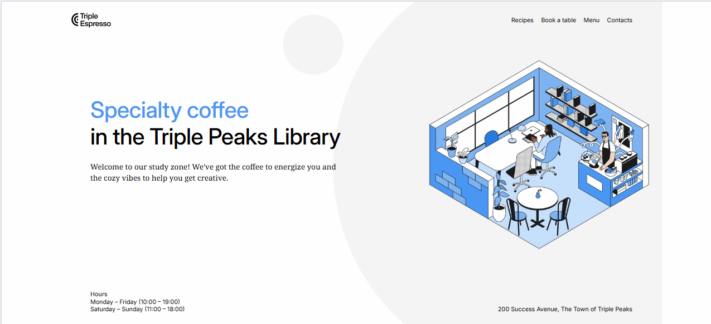

# Triple Peaks Coffee Shop

This is the second project of the Software Engineering program at TripleTen. It was created using HTML and CSS, based on the design brief.

## Project features

- Semantic HTML5
- Flexbox
- Positioning
- Flat BEM file structure
- A custom form
- CSS animation and transform

## Plan on improving the project

While working on the project, I wanted to share an idea on how to improve the webpage. I would like to have a reading mode option; this will allow the author to read the material aloud. This will increase understanding and help cover each step thoroughly.Add your ideas here

## Project Images

